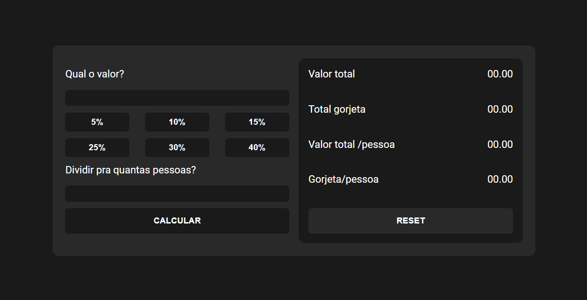

# Sistema de gorjetas

Projeto com o intuito de fazer a distribuição dos valores respectivos para cada membro,
contando com a gorjeta. Tentando passar todas as informações para cada pessoa que está envolvida.


## Screenshots




## Referência

 - [UDEMY - Utilizando DOM](https://www.udemy.com/course/javascript-manipulacao-da-dom/)
 - [Dark Theme](https://blog.prototypr.io/how-to-design-a-dark-theme-for-your-android-app-3daeb264637)


## Técnicas aprendidas

```javascript
    Utilizar os códigos GetElementById e o innetHTML

    function exemplo(){
        const valorTotal = document.getElementById('valorTotal').value;

        valorTotal.innetHTML = '00.00'; //Exemplo
    }

```


## Autores

- [GitHub - @PedroHBitencourt](https://github.com/PedroHBitencourt)
- [LinkedIn - @Pedro Bitencourt](https://www.linkedin.com/in/pedro-henrique-bitencourt-dias-704a65170/)
